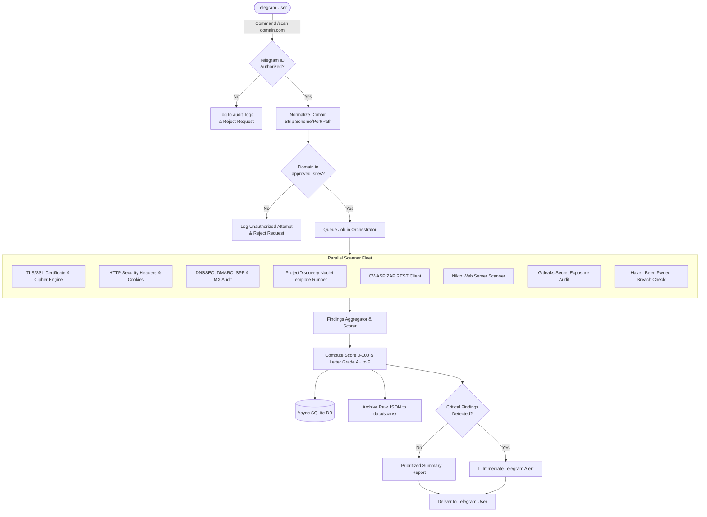

# 🛡️ CyberSentinel — Website Security Health-Check Bot


> **An asynchronous Telegram security assistant coordinating automated, defensive health checks on pre-authorized domains with strict Zero-Trust guardrails, automated posture grading, recurring cron monitoring, and executive audit export.**

---

## Table of Contents

- [Overview](#overview)
- [Architecture & Workflow](#architecture--workflow)
- [Key Features](#key-features)
- [Interactive UI Preview](#interactive-ui-preview)
- [Bot Command Reference](#bot-command-reference)
- [Scanner Fleet Matrix](#scanner-fleet-matrix)
- [Security Guardrails & Hard Rules](#security-guardrails--hard-rules)
- [Project Structure](#project-structure)
- [Getting Started](#getting-started)
  - [Prerequisites](#prerequisites)
  - [Installation](#installation)
  - [Configuration (.env)](#configuration-env)
  - [Running the Bot](#running-the-bot)
- [Automated Testing](#automated-testing)
- [Security Notice & Ethical Use](#security-notice--ethical-use)
- [License](#license)

---

## Overview

**CyberSentinel** is a defensive security operations bot designed for security engineers, system administrators, and site reliability teams. Operating directly inside Telegram, it conducts regular, non-destructive health checks across your domain inventory without requiring complex enterprise dashboard setups.

### Why CyberSentinel?

- **Zero-Trust Guardrails**: Strict domain allowlist (`approved_sites`) with hard normalization prevents arbitrary or unauthorized scans.
- **RBAC by Design**: Strict Telegram User ID filtering blocks unauthorized users before any command handler executes.
- **Built-in & Degraded Engine**: Runs deep TLS, HTTP security headers, and DNS/email security audits out-of-the-box with **zero external binary dependencies**, while seamlessly orchestrating optional scanners (Nuclei, OWASP ZAP, Nikto, Gitleaks, HaveIBeenPwned) if installed.
- **Actionable Posture Scores**: Instant letter grade (`A+` to `F`) with a visual gauge and clear remediation guidance.
- **Continuous Operations**: Automated daily and weekly scheduled scans with immediate alerts on critical security incidents.

---

## Architecture & Workflow



---

## Key Features

| Capability | Description |
| :--- | :--- |
| **🛡️ Native Zero-Binary Auditing** | Out-of-the-box TLS posture, HTTP security headers, and DNS/SPF/DMARC/MX checks using pure asynchronous Python. |
| **🔌 Tool Extensibility** | Integrates with OWASP ZAP, Nuclei, Nikto, Gitleaks, and HaveIBeenPwned with graceful fallback when binaries are absent. |
| **🎯 Objective Scoring** | Standardized 0–100 security posture score based on severity penalty deductions, paired with letter grades (`A+` through `F`). |
| **🚨 Urgent Critical Dispatch** | Critical vulnerabilities (e.g., exposed `.env`, leaked private keys, missing HSTS) trigger immediate high-priority alerts. |
| **⏰ Automated Scheduling** | Enrolls critical assets into daily or weekly cron-like recurring scans (`/schedule`) running autonomously in the background. |
| **📄 Executive Reports** | Generates downloadable, formatted Executive Markdown Audit Reports (`/export <scan_id>`) for stakeholder presentation. |
| **🔒 Immutable Audit Trail** | Every scan request, configuration change, and authorization denial is recorded into SQLite with UTC timestamps and user IDs. |

---

## Interactive UI Preview

### 1. Scan Summary with Health Gauge

```text
🛡️ Security Health-Check Report
━━━━━━━━━━━━━━━━━━━━
• Target: example.com
• Audit ID: scn_20260909_221045_a1b2
• Health Grade: 🟢 [A] EXCELLENT (92/100)
• Posture Gauge: [█████████░] 92%

📊 Executive Breakdown:
• 🚨 Critical (Immediate): 0
• ⚠️ High (Fix Soon): 1
• 🔶 Medium (Minor): 2
• ℹ️ Low / Info: 3
━━━━━━━━━━━━━━━━━━━━

⚠️ SHOULD FIX SOON (High):
• Content Security Policy Missing (headers_scanner)
  Target domain does not emit a Content-Security-Policy header, elevating risk of XSS attacks.
  Action: Deploy a robust CSP policy restricting unauthorized script execution.

🔶 MINOR (Medium):
• Missing Permissions-Policy Header (headers_scanner)
  Browser features such as camera, microphone, and geolocation are not restricted.
• DMARC Quarantine Instead of Reject (dns_scanner)
  DMARC record is set to p=quarantine instead of strict p=reject.
```

### 2. Immediate Critical Incident Alert

```text
🚨🚨 URGENT SECURITY ALERT: STAGING.EXAMPLE.COM 🚨🚨
Immediate attention is required! 1 critical issue(s) detected during automated health check:

1. Critical Secret Exposure (.env File Publicly Accessible)
• Tool: headers_scanner
• Details: Publicly reachable environment file detected at https://staging.example.com/.env.
• Action Required: Restrict web server access to dotfiles immediately and rotate all exposed secrets.
• Reference: https://cwe.mitre.org/data/definitions/552.html

⚠️ Please take immediate containment or remediation actions.
```

---

## Bot Command Reference

| Command | Arguments | Access Level | Description |
| :--- | :--- | :---: | :--- |
| `/help`, `/start` | None | Authorized | Displays system manual, operational status, and current Telegram ID. |
| `/check`, `/scan` | `<domain>` | Authorized | Validates domain against allowlist and queues a background security audit. |
| `/checkall` | None | Authorized | Batch queues automated health checks across all approved domains. |
| `/status` | None | Authorized | Displays currently executing background scan jobs and elapsed times. |
| `/history` | `<domain>` | Authorized | Shows past 5 scans for the domain, historical score trends, and health grades. |
| `/history_detail` | `<scan_id>` | Authorized | Displays full findings breakdown and raw diagnostics for a specific scan. |
| `/export` | `<scan_id>` | Authorized | Compiles and sends a downloadable Executive Markdown Audit Report document. |
| `/schedule` | `<domain> <daily\|weekly>` | Authorized | Registers recurring automated background monitoring for an approved domain. |
| `/unschedule` | `<domain>` | Authorized | Deregisters an active recurring monitoring schedule. |
| `/schedules` | None | Authorized | Lists all currently active recurring monitoring schedules and intervals. |
| `/addsite` | `<domain> [note]` | Authorized | Adds or reactivates a domain in the authorized target allowlist. |
| `/removesite` | `<domain>` | Authorized | Revokes approval for a domain (all future scans will be denied). |
| `/listsites` | None | Authorized | Lists all approved domains and their latest recorded security grade. |
| `/audit` | None | Authorized | Displays the last 10 security audit records (authorized & denied attempts). |
| `/reset` | None | Authorized | Clears active conversational memory with the Gemini AI assistant. |
| **Natural Language** | `<message>` | Authorized | Direct chat with Gemini Pro assistant to analyze findings, ask cybersecurity questions, or trigger audits. |

---

## Scanner Fleet Matrix

CyberSentinel leverages a modular scanner plugin architecture. Scanners operate independently in parallel, returning standardized finding objects:

| Scanner | Category | Core Checks & Vectors | Requirements | Fallback Mode |
| :--- | :---: | :--- | :---: | :---: |
| **TLS/SSL Engine** | Built-in | Certificate validity, expiration (<30d warning), trust chains, SAN coverage, deprecated protocols (TLS 1.0/1.1), HSTS enforcement. | Pure Python | **Always Active** |
| **HTTP Security Headers** | Built-in | CSP, HSTS, X-Frame-Options, X-Content-Type-Options, Referrer-Policy, Permissions-Policy, cookie security (`Secure`, `HttpOnly`, `SameSite`), sensitive dotfile exposure (`.env`, `/.git/HEAD`). | `httpx` | **Always Active** |
| **DNS & Email Posture** | Built-in | SPF records & permissive wildcards (`+all`), DMARC policy enforcement (`p=reject`), MX exchange verification, DNSSEC signing. | `dnspython` | **Always Active** |
| **Nuclei** | External | CVE scanning, exposed panels, misconfigurations, technology detection. | `nuclei` binary | Gracefully skips if uninstalled |
| **OWASP ZAP** | External | Active / passive proxy alerts via REST API. | ZAP Daemon | Gracefully skips if unreachable |
| **Nikto** | External | Web server banner disclosure, dangerous files/programs, outdated software. | `nikto` binary | Gracefully skips if uninstalled |
| **Gitleaks** | External | Uncommitted/committed credentials, API keys, certificates in associated repositories. | `gitleaks` binary | Gracefully skips if uninstalled |
| **Have I Been Pwned** | External | Verification of organizational emails and domain exposure in breach databases. | HIBP API Key | Gracefully skips if unconfigured |

---

## Security Guardrails & Hard Rules

### 1. Strict Domain Allowlist (`approved_sites`)

- All scan targets **must** be pre-registered via `/addsite <domain>`.
- The bot applies RFC-compliant domain normalization:

  ```text
  https://Sub.Domain.com:8443/path?param=123#frag  ──▶  sub.domain.com
  ```

- **Zero Override**: If a target domain is not present in the allowlist, the scan is rejected immediately and an event is logged in the `audit_logs` table.
- Non-destructive by design: Scans only perform inspection of public-facing endpoints and configurations. Exploitation scripts, fuzzing, and brute-forcing are completely prohibited.

### 2. Role-Based Access Control (RBAC)

- Commands are gated by the `@restricted_access` decorator.
- Only Telegram User IDs listed in `ALLOWED_TELEGRAM_USER_IDS` can execute commands or query scan data.
- Unauthorized interaction attempts are blocked silently or with an access-denied message and recorded in the audit trail.

---

## Project Structure

```text
d:\TELEGRAM AGENT\
├── run_bot.py                  # Application entry point launcher
├── requirements.txt            # Python dependencies
├── pytest.ini                  # Pytest runner configuration
├── .env.example                # Environment configuration template
├── README.md                   # Project documentation & operational guide
├── src/
│   ├── config.py               # Pydantic environment configuration loader
│   ├── database/
│   │   ├── db.py               # Asynchronous SQLite interface (aiosqlite)
│   │   └── models.py           # Data schemas (Finding, Severity, ScanRecord, Schedule)
│   ├── security/
│   │   ├── allowlist.py        # Domain normalization & allowlist enforcement
│   │   └── auth_filter.py      # Telegram User ID access control decorator
│   ├── scanners/
│   │   ├── base.py             # Abstract base scanner interface
│   │   ├── tls_scanner.py      # TLS/SSL certificate & protocol validator
│   │   ├── headers_scanner.py  # HTTP security headers, cookies & sensitive exposure
│   │   ├── dns_scanner.py      # DNSSEC, SPF, DMARC, and MX verification
│   │   ├── nuclei_scanner.py   # ProjectDiscovery Nuclei runner & parser
│   │   ├── zap_scanner.py      # OWASP ZAP REST client
│   │   ├── nikto_scanner.py    # Nikto web server scanner integration
│   │   ├── gitleaks_scanner.py # Git secret exposure auditor
│   │   └── hibp_scanner.py     # Have I Been Pwned breach checker
│   ├── core/
│   │   ├── orchestrator.py     # Parallel scan coordinator & concurrency limiter
│   │   ├── scorer.py           # Objective security scoring & grading engine
│   │   ├── formatter.py        # Telegram markdown message builder & alert composer
│   │   └── exporter.py         # Executive Markdown audit report exporter
│   └── bot/
│       ├── handlers.py         # Telegram command handlers & input validation
│       └── main.py             # Bot application lifecycle & scheduler loop
└── tests/                      # Automated test suite (unit & integration)
    ├── test_allowlist.py       # Normalization & allowlist unit tests
    ├── test_auth.py            # RBAC authorization decorator tests
    ├── test_dns_scanner.py     # DNS & DMARC audit unit tests
    ├── test_exporter.py        # Executive report exporter tests
    ├── test_headers_scanner.py # HTTP security headers & sensitive file tests
    ├── test_orchestrator.py    # Concurrency and scan orchestrator tests
    ├── test_scanners.py        # Nuclei, ZAP, Nikto, Gitleaks, HIBP tests
    ├── test_schedules_db.py    # Recurring schedules database tests
    ├── test_scorer.py          # Score calculation & grading tests
    └── test_tls_scanner.py     # TLS certificate & protocol audit tests
```

---

## Getting Started

### Prerequisites

- **Python 3.10+** (Tested on Python 3.10, 3.11, 3.12, 3.13)
- A **Telegram Bot Token** generated from [@BotFather](https://t.me/BotFather)
- Your numeric **Telegram User ID** retrieved from [@userinfobot](https://t.me/userinfobot)

### Installation

1. **Clone the repository**:

   ```bash
   git clone https://github.com/tarunagnihotri534/CYBER.git
   cd CYBER
   ```

2. **Create and activate a virtual environment**:

   - **Windows (PowerShell)**:

     ```powershell
     python -m venv .venv
     .\.venv\Scripts\Activate.ps1
     ```

   - **Linux / macOS**:

     ```bash
     python3 -m venv .venv
     source .venv/bin/activate
     ```

3. **Install dependencies**:

   ```bash
   pip install --upgrade pip
   pip install -r requirements.txt
   ```

### Configuration (.env)

Duplicate `.env.example` to create your working `.env`:

```bash
cp .env.example .env         # On Linux / macOS
Copy-Item .env.example .env  # On Windows PowerShell
```

Configure your environment variables:

| Variable | Required | Default | Description |
| :--- | :---: | :--- | :--- |
| `TELEGRAM_BOT_TOKEN` | **Yes** | — | API Token issued by @BotFather. |
| `ALLOWED_TELEGRAM_USER_IDS` | **Yes** | — | Comma-separated list of numeric Telegram User IDs permitted to use the bot. |
| `DB_PATH` | No | `data/security_bot.db` | SQLite database filepath. |
| `RAW_OUTPUT_DIR` | No | `data/scans` | Directory where full raw scanner JSON outputs are archived. |
| `MAX_CONCURRENT_SCANS` | No | `2` | Maximum concurrent background scans permitted. |
| `ZAP_BASE_URL` | No | `http://localhost:8080` | URL for OWASP ZAP REST API daemon. |
| `ZAP_API_KEY` | No | `""` | API key for OWASP ZAP (if configured). |
| `NUCLEI_BIN` | No | Auto-detect | Path to `nuclei` binary (or leave empty if on system PATH). |
| `NIKTO_BIN` | No | Auto-detect | Path to `nikto` binary (or leave empty if on system PATH). |
| `GITLEAKS_BIN` | No | Auto-detect | Path to `gitleaks` binary (or leave empty if on system PATH). |
| `HIBP_API_KEY` | No | `""` | Have I Been Pwned API Key (for breach searches). |
| `GEMINI_API_KEY` | No | `""` | Google Gemini API Key (for conversational AI assistant and tool-calling). |
| `GEMINI_MODEL` | No | `gemini-2.5-pro` | Gemini model name (`gemini-2.5-pro`, `gemini-1.5-pro`, etc.). |

### Running the Bot

Launch the assistant:

```powershell
.\.venv\Scripts\python run_bot.py
```

*(Or `python run_bot.py` with the virtual environment activated).*

---

## Automated Testing

The project includes an extensive test suite covering authorization, allowlist normalization, all scanner modules, scoring calculations, export generation, and database interactions.

Run the test suite with `pytest`:

```bash
pytest -v
```

Expected output:

```text
============================= test session starts =============================
platform win32 -- Python 3.13.0, pytest-9.1.1, pluggy-1.6.0
rootdir: D:\TELEGRAM AGENT
configfile: pytest.ini
testpaths: tests
collected 24 items

tests\test_allowlist.py ....                                             [ 16%]
tests\test_auth.py ...                                                   [ 29%]
tests\test_dns_scanner.py ...                                            [ 41%]
tests\test_exporter.py .                                                 [ 45%]
tests\test_headers_scanner.py ...                                        [ 58%]
tests\test_orchestrator.py .                                             [ 62%]
tests\test_scanners.py ....                                              [ 79%]
tests\test_schedules_db.py .                                             [ 83%]
tests\test_scorer.py ..                                                  [ 91%]
tests\test_tls_scanner.py ..                                             [100%]

============================= 24 passed in 14.20s =============================
```

---

## Security Notice & Ethical Use

> [!IMPORTANT]
> **Strictly Authorized Auditing Only**: CyberSentinel is built exclusively for defensive security posture verification, compliance monitoring, and vulnerability management on **domains and systems you own or have explicit, documented authorization to test**.
>
> Scanning third-party infrastructure without explicit authorization may violate applicable laws and regulations (including the Computer Fraud and Abuse Act, GDPR, and regional cybersecurity legislation). The authors assume no liability for misuse of this tool.

---

## License

This project is licensed under the **MIT License** — see the [LICENSE](LICENSE) file for details.
